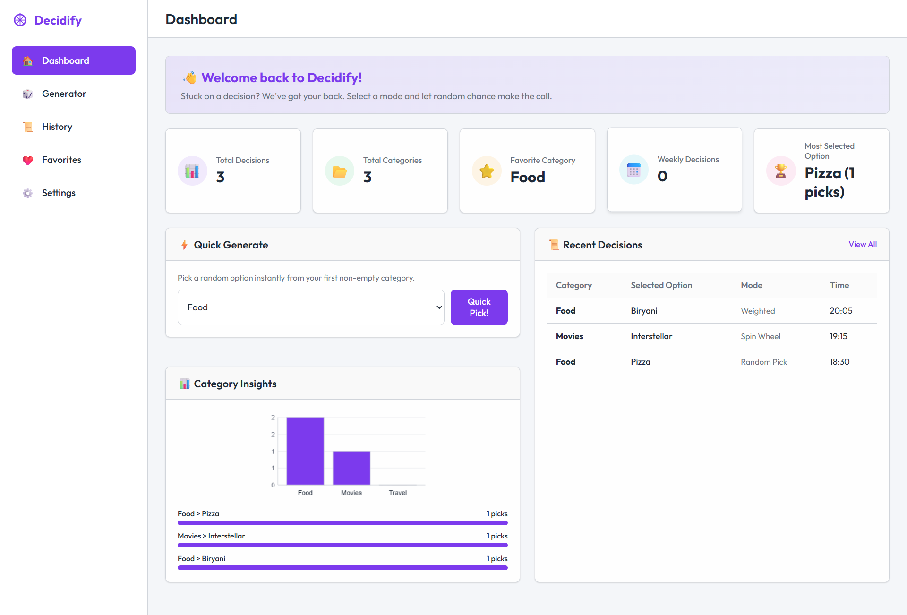
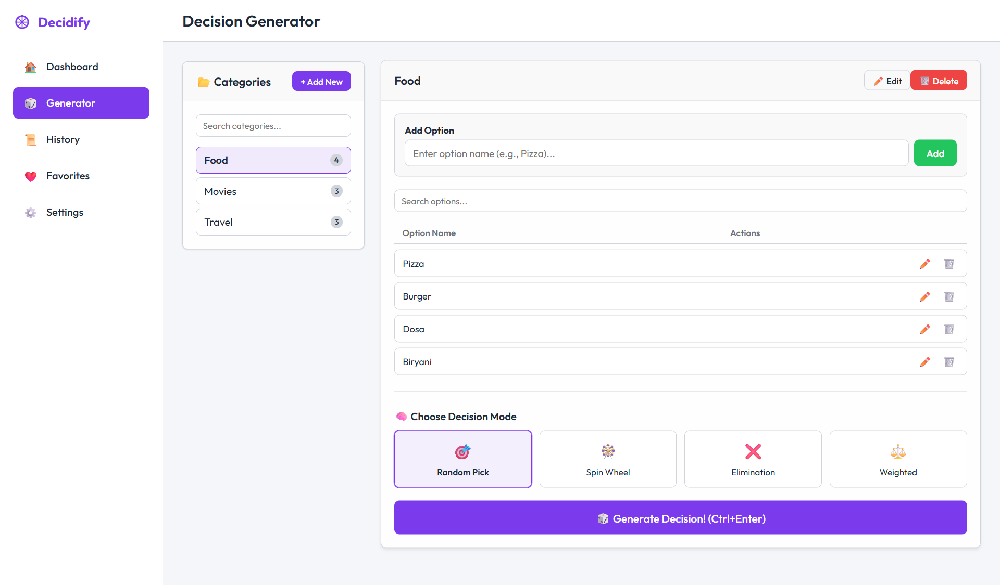
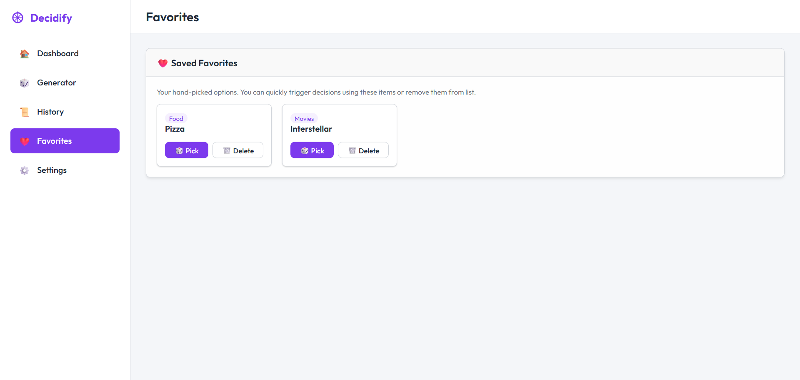
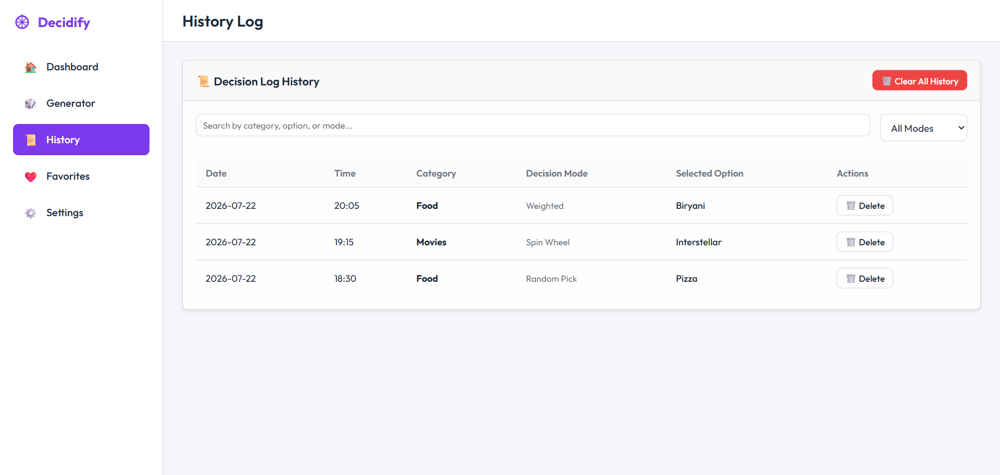
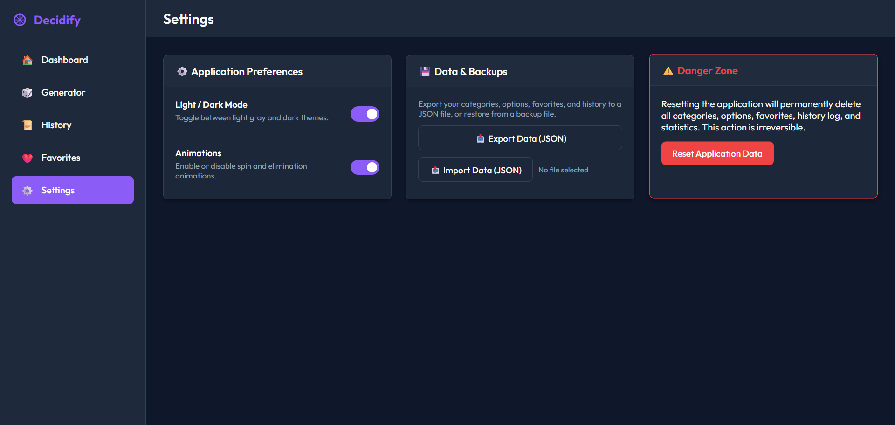
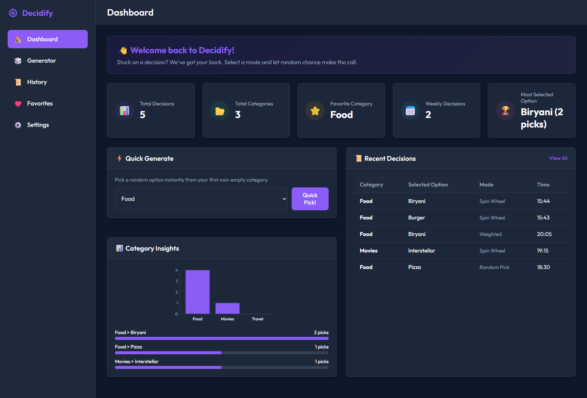
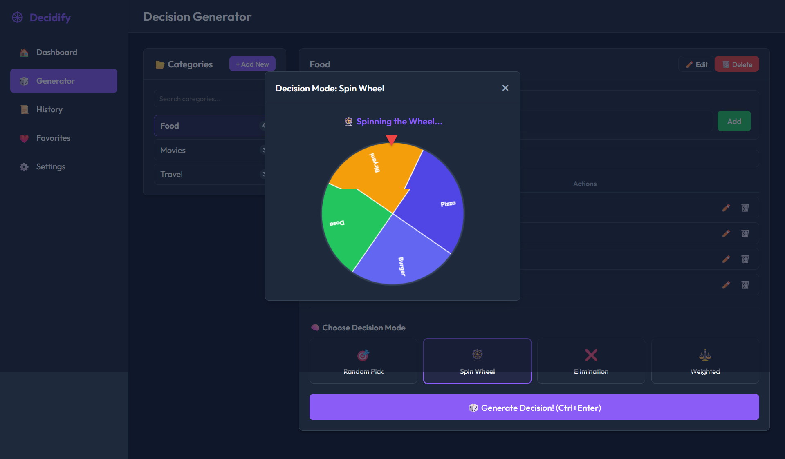

# Decidify

Decidify is an interactive decision-making web application designed to help users make choices quickly and easily.

## Features

- 🎯 Random decision generator
- 🎡 Spin wheel
- ⚖️ Weighted decision making
- ❌ Elimination mode
- ❤️ Favorites
- 📜 Decision history
- 🎲 Random pick
- 🌙 Light and dark mode
- 📱 Responsive interface
- 💾 LocalStorage-based data persistence

## Technologies Used

- HTML5
- CSS3
- JavaScript
- LocalStorage

## How to Run

1. Clone the repository:

```bash
git clone https://github.com/YOUR_USERNAME/Decidify.git


## Project Preview

### Dashboard



### Decision Generator



### Favorites



### History



### Settings



### Dark Mode



### Spin Wheel


